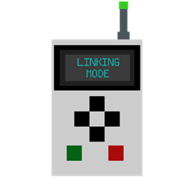

---
navigation:
  parent: index.md
  title: Storage Interface
  icon: storage_interface
item_ids:
  - utilitydrawers:storage_interface
---

# Storage Interface

The <ItemLink id="storage_interface" /> links a group of nearby drawers together into one network, letting you pipe items or fluids into a single block and have it automatically distribute them across every connected drawer. The storage interface also works with AE2 storage buses and Refined Storage external storages, allowing you to view the contents of your drawer network through a digital display.

## Linking drawers

Linking is done with the [Storage Remote](storage_remote.md): 

Bind a <ItemLink id="storage_remote" /> to the <ItemLink id="storage_interface" />, then right-click drawers (or use Multi-Select to link a whole region at once) to connect them. See the [Storage Remote](storage_remote.md) page for the full workflow, including single-drawer and area linking.

<GameScene zoom={2.0} interactive={true}>
  <ImportStructure src="storage_interface.snbt" />
  <IsometricCamera yaw="135" pitch="30" />

  <BlockAnnotation x="11" y="0" z="7" color="#0080ff">
    Storage Interface (Unlocked)
  </BlockAnnotation>

  <BlockAnnotation x="5" y="0" z="7" color="#0080ff">
    Linked Drawer
  </BlockAnnotation>
  <BlockAnnotation x="6" y="0" z="7" color="#0080ff">
    Linked Drawer
  </BlockAnnotation>
  <BlockAnnotation x="7" y="0" z="7" color="#0080ff">
    Linked Drawer
  </BlockAnnotation>
  <BlockAnnotation x="8" y="0" z="7" color="#0080ff">
    Linked Drawer
  </BlockAnnotation>
  <BlockAnnotation x="9" y="0" z="7" color="#0080ff">
    Linked Drawer
  </BlockAnnotation>

  <BlockAnnotation x="5" y="1" z="7" color="#0080ff">
    Linked Drawer
  </BlockAnnotation>
  <BlockAnnotation x="6" y="1" z="7" color="#0080ff">
    Linked Drawer
  </BlockAnnotation>
  <BlockAnnotation x="7" y="1" z="7" color="#0080ff">
    Linked Drawer
  </BlockAnnotation>
  <BlockAnnotation x="8" y="1" z="7" color="#0080ff">
    Linked Drawer
  </BlockAnnotation>
  <BlockAnnotation x="9" y="1" z="7" color="#0080ff">
    Linked Drawer
  </BlockAnnotation>

  <BlockAnnotation x="6" y="2" z="7" color="#0080ff">
    Linked Drawer
  </BlockAnnotation>
  <BlockAnnotation x="7" y="2" z="7" color="#0080ff">
    Linked Drawer
  </BlockAnnotation>
  <BlockAnnotation x="8" y="2" z="7" color="#0080ff">
    Linked Drawer
  </BlockAnnotation>
  <BlockAnnotation x="9" y="2" z="7" color="#0080ff">
    Linked Drawer
  </BlockAnnotation>
</GameScene>

## Range

The Storage Interface can only link to drawers within its range, which by default is 16 blocks (can be changed in the config). Placing a tiered upgrade (see [Upgrades](upgrades.md)) into the interface's upgrade slot multiplies its range, up to 512 blocks with a <ItemLink id="drawer_upgrade_t4" />, use responsibly.

## Inserting items and fluids

When something is inserted into the network:

1. It first tries to stack into any connected drawer slot that already holds a matching item or fluid.
2. If nothing matches, it fills the next available empty (and unlocked, or locked-with-matching-template) slot.

## Locking the whole network

The Storage Interface can toggle the locked state of every connected drawer at once. This is done by right-clicking the interface itself with a [Storage Remote](storage_remote.md) set to Lock mode. This is handy for keeping automation targeting consistent template slots across your whole storage room.

<GameScene zoom={3.5} interactive={true}>
  <ImportStructure src="locked.snbt" />
  <IsometricCamera yaw="135" pitch="30" />

  <BlockAnnotation x="6" y="0" z="7">
    This interface is currently unlocked.
  </BlockAnnotation>

  <BlockAnnotation x="8" y="0" z="7">
    This interface is currently locked.
  </BlockAnnotation>
</GameScene>

## Viewing network contents

Attach a [Storage Viewer](storage_viewer.md) to browse and search everything stored across the network from one screen.