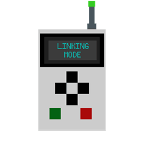
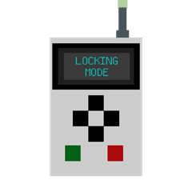

---
navigation:
parent: index.md
title: Storage Remote
icon: storage_remote
item_ids:
- utilitydrawers:storage_remote
---

# Storage Remote

The Storage Remote is the tool used to link drawers and Storage Viewers to a [Storage Interface](storage_interface.md), and to remotely lock or unlock drawers, all without needing to reach the interface itself.

It has two independent modes: **Link/Unlink** and **Lock/Unlock**. Shift + scroll while holding the remote to switch between them. The current mode is shown in the item's tooltip.

## Link/Unlink mode

### Binding to a Storage Interface

Shift + right-click a [Storage Interface](storage_interface.md) to bind the remote to it. The bound interface's position is shown in the tooltip. Shift + right-click while pointing at open air to unbind.

### Linking drawers

Once bound, right-click any drawer (item, fluid, compacting, or wireless) to link it to the bound interface, as long as it is within the interface's range.

**Quick Reference**

- **Unlinked drawer** → Links it.
- **Drawer linked to the bound interface** → Unlinks it.
- **Drawer linked to another interface** → Nothing changes, and a warning is displayed.

### Linking a Storage Viewer

The same right-click toggle works on a [Storage Viewer](storage_viewer.md). This lets you rebind a viewer to a different interface or disconnect it without needing to break and replace the block.

### Single vs. Multi-Select

Shift + left-click while pointing at air toggles between **Single** and **Multi-Select** modes.

**Single** mode links or unlinks one drawer at a time.

**Multi-Select** mode lets you link every drawer inside a cuboid region at once:

1. Right-click the first corner of the selection.
2. Right-click the opposite corner.
3. Every drawer inside the region that is within range and not already linked elsewhere is linked.

Drawers already linked to the bound interface are left unchanged rather than being unlinked.

## Lock/Unlock mode

Right-click any drawer to toggle its lock state directly without needing to sneak-right-click the drawer itself.

Right-clicking a Storage Interface while in this mode toggles the locked state of every drawer connected to its network at once, just like using the interface's own lock button.

**Quick Reference**

- **Right-click a drawer** → Toggle that drawer's locked state.
- **Right-click a Storage Interface** → Toggle the locked state of every connected drawer.