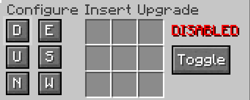
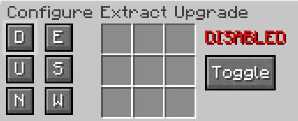

---
navigation:
  parent: index.md
  title: Utility Upgrades
  icon: void_upgrade
item_ids:
  - utilitydrawers:insert_upgrade
  - utilitydrawers:extract_upgrade
  - utilitydrawers:void_upgrade
---

# Utility Upgrades

The <ItemLink id="insert_upgrade" /> and <ItemLink id="extract_upgrade" /> allow your drawers to automatically push or pull items and fluids to and from adjacent blocks.

Unlike standard capacity upgrades, these utility upgrades must be placed in a drawer's designated **utility slots** to function.

## Insert Upgrade

The <ItemLink id="insert_upgrade" /> looks for adjacent blocks (like chests, tanks, or machines) and pulls matching items and fluids *into* the drawer.

## Extract Upgrade

The <ItemLink id="extract_upgrade" /> does the exact opposite, automatically pushing the stored contents of the drawer *out* into adjacent inventories or fluid tanks.

## Void Upgrade

The <ItemLink id="void_upgrade" /> destroys any overflow instead of rejecting it once a drawer is full. Useful for automatically discarding excess items or fluids from an automated system instead of having it back up.

## Configuration & Filtering

Utility upgrades must be configured before they will do anything. You can open the configuration menu in two ways:
* **From your hand:** Right-click while holding the upgrade.
* **From a drawer:** Hover over the slotted upgrade in the drawer's GUI and press the **Open Upgrade Config** keybind.

### Sided Filters
In the configuration menu, you can toggle exactly which block faces (Down, Up, North, East, South, West) the upgrade interacts with. Every single active direction has its own independent 9-slot filter.

* If a direction is active but its filter slots are left empty, the upgrade acts as a universal whitelist, moving **all** valid items and fluids.
* If you assign items or fluids to the filter slots, the upgrade will strictly transfer only those specific resources on that side.

* *Tip*: If you want to wipe an upgrade clean, Sneak + Right-Click while holding it in your hand or put it through a crafting interface (inventory, crafting table, etc.) to instantly reset all active directions and filters.*

## Related
[Upgrades](upgrades.md)